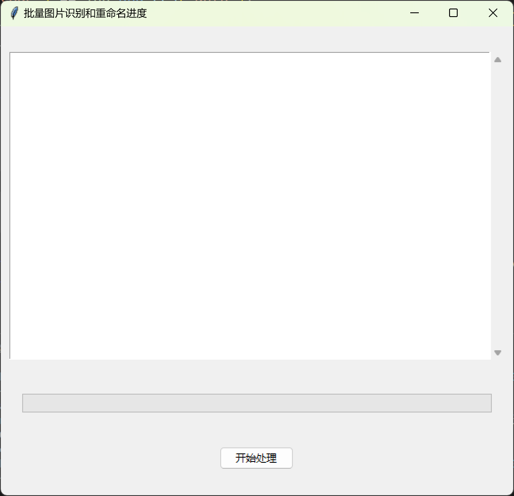

# 批量识别重命名图形化改进版

## 简介

一个基于Python开发的批量图片识别和重命名工具，使用PaddleOCR引擎自动识别图片中的文字内容，并将识别结果作为文件名对图片进行重命名。

## 功能特点

- 批量处理图片文件（支持PNG、JPG、JPEG格式）
- 使用PaddleOCR引擎进行高精度文字识别
- 直观的图形用户界面显示处理进度
- 自动跳过已存在的文件名避免冲突
- 简洁易用的操作界面

## 安装要求

- Windows操作系统（推荐Windows 10或更高版本）
- Python 3.6+（如果使用源代码版本）
- 必要的依赖库（自动安装）

## 使用方法

1. 将需要处理的图片文件放入程序目录下的`pic`文件夹中
2. 运行程序
3. 点击"开始处理"按钮
4. 程序将自动识别图片中的文字并重命名文件
5. 在文本框中查看处理进度和结果

## 文件结构

```
程序目录/
├── PaddleOCR-json/      # OCR引擎文件
│   └── PaddleOCR-json.exe
├── pic/                 # 图片文件夹（存放待处理图片）
├── 批量识别重命名图形化改进版.exe             # 主程序（可执行文件）
└── README.md           # 说明文档
```

## 注意事项

- 确保`pic`文件夹存在，否则程序无法处理图片
- 图片命名将使用识别到的前100个字符
- 如果识别结果已存在同名文件，将跳过重命名
- 处理大量图片时可能需要较长时间，请耐心等待

## 软件界面


## 技术支持

- **开发者：速光网络软件开发**
- 官网：suguang.cc
- 联系电话/微信：15120086569
- 抖音号：dubaishun12

## 版权信息

Copyright © 2025 速光网络软件开发. All rights reserved.

---
*关注我们的抖音账号获取最新更新和技术支持！*